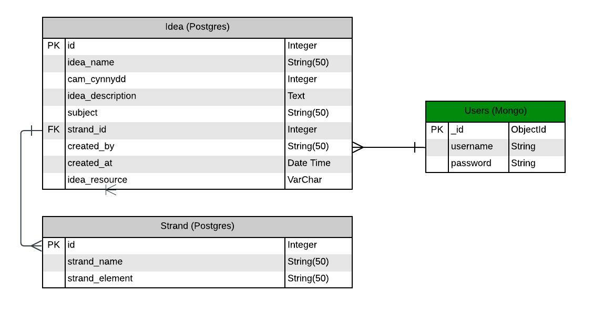

# **DCF Ideas**

DCF Ideas is a web Application, built specifically for the Milestone 3, Data-Centric Development Project for the Code Institute Full Stack Software Development Diploma. The purpose of the project, is to give users access to sharable information and ideas, around the Digital Competence Framework (DCF) for schools, through a number of different platforms. The Application is built, following the "CRUD" principles and will allow users to Create, Read, Update and Delete content. 

[View the live project on Heroku](https://dcfideas.herokuapp.com/)


---
## **Contents**

- [UX Design](#ux-design)
- [UI Design](#ux-design)
- [Wireframes](#wireframes)
- [Data Structure](#data-structure) 
- [Existing Features](#existing-features)
- [Future Features](#future-features)
- [Technologies Used](#technologies-used)
- [Testing](#testing)
- [Lessons Learned](#lessons-learned)
- [Deployment](#deployment)
- [Credits](#credits)

---

## **UX Design**

### **A Persona Summary of the Users/Teachers of DCF Ideas**

DCF Ideas is for users/teachers of all ages, diverse demographics (please see next paragraph) and subject specialties, who want to keep track of their own DCF ideas with the additional means to share their ideas, and read the ideas from fellow teachers.

The website is based on the Digital Competence Framework for Wales therefore users/teachers are expected to understand some Welsh Terminology.

### **User Goals**

- Be able to create, read, edit or delete own ideas.
- Be able to read ideas from other site users.
- Be able to search and filter ideas. 

### **Site Owners Goals**

- Provide a positive experience for all users/teachers, looking to access the website.
- Inspire users/teachers to find lesson ideas they might not have heard of, and compel them to implement some DCF in their lessons, potentially increasing DCF coverage of the school and improving standards.

### **User Stories, Use Cases and Expectations**

#### **Expectations**

- Easy to use
- Easy to navigate
- Responsive across all devices.
- Notifications that tell the user when they have carried out a relevant activity.

#### **User Stories and Use Cases**
* **User Story 001 (User/Teacher):** as a new user/teacher I want to join DCF Ideas to store details about my ideas so that I can share them with my fellow colleagues.
	*   **Use Case 001-001 (C in User CRUD):** as a new user/teacher I want to register an account with the DCF Ideas.
	*   **Use Case 001-002:** as a user/teacher I want to Log In to DCF Ideas

*  **User Story 002 (User/Teacher):** as a user/Teacher I want the ability to manage my user profile so that I can have the best possible user/Teacher experience.
	*   **Use Case 002-001 (U in User CRUD):** as a user/teacher I want to reset my password.
	*   **Use Case 002-002 (D in User CRUD):** as a user/teacher I want to delete my account.

*  **User Story 003 (User/Teacher):** as a user/teacher I want to manage my stack/library of ideas in the DCF Ideas so that I can share my ideas with like-minded Teachers, and keep track of my growing list of ideas.
	*   **Use Case 003-001 (C in idea CRUD):** as a user/teacher I want to create a new idea from My Profile.
	*   **Use Case 003-002 (C in idea CRUD):** as a user/teacher I want to create a new idea from shared ideas page.
	*   **Use Case 003-003 (R in idea CRUD):** as a user/teacher I want to view one of my ideas in my profile.
	*   **Use Case 003-004 (U in idea CRUD):** as a user/teacher I want to update/edit an existing idea in my profile.
	*   **Use Case 003-005 (D in idea CRUD):** as a user/teacher I want to delete an existing idea in my profile.
    *   **Use Case 003-006 (R in idea CRUD):** as a user/teacher I want to view one of my ideas in shared ideas page.
	*   **Use Case 003-007 (U in idea CRUD):** as a user/teacher I want to update/edit an existing idea in shared ideas page.
	*   **Use Case 003-008 (D in idea CRUD):** as a user/teacher I want to delete an existing idea in shared ideas page.

*  **User Story 004 (User/Teacher):** as a user/teacher I want to filter and search for ideas so that I can find new lesson ideas.
	*   **Use Case 004-001 (R in idea CRUD):** as a user/teacher I want to search for a specific idea in the shared ideas page.
    *   **Use Case 004-002 (R in idea CRUD):** as a user/teacher I want to filter ideas by cam_cynnydd in the shared ideas page.
    *   **Use Case 004-003 (R in idea CRUD):** as a user/teacher I want to filter ideas by subject in the shared ideas page.
    *   **Use Case 004-004 (R in idea CRUD):** as a user/teacher I want to filter ideas by strand in the shared ideas page.
    *   **Use Case 004-005 (R in idea CRUD):** as a user/teacher I want to view most recent posted ideas.

*  **User Story 005 (User 'admin'):** as an admin I want to manage the posted ideas so that I can provide the best possible DCF Ideas experience for the users/Teachers.
	*   **Use Case 005-005 (C in idea CRUD):** as an admin I want to create some sample ideas to the shared ideas page so that I can start off the DCF Ideas with some ideas and also use for testing purposes.
	*   **Use Case 005-001 (R in idea CRUD):** as an admin I want to view the posted ideas.
	*   **Use Case 005-002 (U in idea CRUD):** as an admin I want to edit the posted ideas.
	*   **Use Case 005-003 (D in idea CRUD):** as an admin I want to delete the posted ideas. 
	*   **Use Case 005-004 (C in USER ADMIN CRUD):** as an admin I want to be able to create a new user account.
    *   **Use Case 005-005 (R in USER ADMIN CRUD):** as an admin I want to be able to view a list of all users.
    *   **Use Case 005-006 (U in USER ADMIN CRUD):** as an admin I want to be able to update user's usernames.
    *   **Use Case 005-007 (D in USER ADMIN CRUD):** as an admin I want to be able to delete a user's account.


## **UI Design**

### **Fonts**
- The project uses Google Fonts for the delivery of the main font styling.
- The fonts used are Open Sans for main body and Nunito for headers. These have been used due to their clean and modern style.
- The back-up font used for the project is Sans-Serif.

### **Colour Scheme**

 The overall colour palette was designed from a website called [Coolors](https://coolors.co/). The colour scheme was chosen to make the site look visually appealing, using a blue colour palette, as this portrays calmness and confidence (using colour psychology). The colours were checked for sufficient contrast using [EightShapes](https://contrast-grid.eightshapes.com/?version=1.1.0&background-colors=&foreground-colors=%23565656%0D%0A%23012970%0D%0A%234154F1%0D%0A%232DB6FA%0D%0A%23F6F9FF%0D%0A%23FFFFFF%2C%20White%0D%0A&es-color-form__tile-size=compact&es-color-form__show-contrast=aaa&es-color-form__show-contrast=aa&es-color-form__show-contrast=aa18&es-color-form__show-contrast=dnp)


### **Icons**
- The strand icons were provided by [Flat Icon](https://www.flaticon.com/) library.
- All other icons were provided by the [Font Awesome](https://fontawesome.com/v5/search) library.

---

## **Wireframes**

### **Low Fidelity Wireframes**

Low fidelity wireframes were created with Affinity Photo for the basic prototyping structure of how the main site pages may initially be designed to look. 

- [Idaas](dcfideas/static/img/documentation/wireframe-ideas.png)
- [Profile Page](dcfideas/static/img/documentation/wireframe-profile.png)
- [Login/Register Page](dcfideas/static/img/documentation/wireframe-login-register.png)
- [Full Idea Page](dcfideas/static/img/documentation/wireframe-full-idea.png)

---

## **Data Structure**
 - [MongoDB](https://www.mongodb.com/) is a cloud based storage application, hosting storage of the user account data for DCF Ideas. 
 - [PostgreSQL](https://www.postgresql.org/) is used as the backend functionality of the application, that allows users to create, read, update, delete and search data records on the app.

 ### **Outline of the structure used.**

- **Strands collection**
    - This collection holds the strand_name key. The strands relate to the strands from the Digital Compentency Framework for Wales, these are categories for the type of ideas that are being linked to. These strands are fixed, with no need to add/remove. There are element/sub-categories for each strand. 
    - The strand id links this collection to the idea collection.

- **Ideas collection**
    - This collection holds several keys for the ideas page where the user can create and view all the ideas in the database.
    - The data keys include the id,
    idea_name, cam_cynnydd, idea_description, subject, strand_id, created_by, created_at and idea_resource.

- **Users collection**
    - This collection holds two keys about the user which is provided by the user on the register page and used again on the log in page.
    - The data keys include the username and password. 

---

## **Existing Features**

Features currently implemented as a part of DCF Ideas.

### **User Management:**

* User/teacher registration (C is User CRUD).
* User/teacher login after registration (R in User CRUD).
* User/teacher profile update, with password change (U in User CRUD).
* User/teacher delete account (D in User CRUD).
* User/teacher sign out.

### **DCF Ideas:**

* Profile Page with:
	* The ability to view the user's own ideas, the full details, edit/update an idea, and delete an idea (RUD in idea CRUD).
	* The ability to add a new idea via profile page (C in idea CRUD).
* Search ideas from Ideas Page (R in idea CRUD):
	* The ability to browse and view ideas matching the search criteria.
    * The ability to filter ideas by strand.
    * The ability to filter ideas by subject.
    * The ability to filter ideas by cam cynnydd.
    * The ability to filter most recent ideas.
* CRUD Ideas from Ideas Page:
	* The ability to add a new idea via Ideas page (C in idea CRUD).
    * The ability to read, update and delete user's own idea via Ideas page (RUD in idea CRUD).
    * The ability to read other users idea via Ideas page (R in idea CRUD).
    * The ability to read full details other users ideas via Ideas page (R in idea CRUD).
    * The inability to update or delete other users idea via Ideas page (UD in idea CRUD).

### **Admin User:**

* CRUD Ideas from Ideas Page:
    * The ability to add a new idea via Ideas page (C in idea CRUD).
    * The ability to read, update and delete user's own ideas via Ideas page (RUD in idea CRUD).
    * The ability to read other users idea via Ideas page (R in idea CRUD).
    * The ability to read full details other users ideas via Ideas page (R in idea CRUD).
    * The ability to update or delete other users idea via Ideas page (UD in idea CRUD).

### **Shared Features:**

* Fixed Navigation Bar (Hamburger-Menu) with:
    * Brand Logo
        * Acts as a link to homepage
    * Page links
        * Not logged in: Home, About, Ideas, Login, Register
        * Logged in: Home, About, Ideas, My Profile
* Fixed Footer About Modal with:
	* Site Title
    * Description
    * Social and Contact Links for the school this website is built for
    * Address of the school this website is built for
    * Useful Links
	* Short "ego-page".
	* Credits for Template
    * Copyright Info
* Back to Top Button
    * Floating button that is controlled by JQuery code, showing a blue square button with an up arrow, in the bottom right of the webpage, once a certain scroll distance has been reached. The button when clicked, smoothly scrolls the user back to the top of the page being displayed.
* Registration and login forms
    * Simple and easy to use
    * Uses validation 
    * Password visibility toggle button
    * If a user navigates to the registration page but already has an account, they can navigate to the login page via the login link. This can also be accessed via the Login page link in the navbar. 
    * If a user navigates to the login page but doesn't have an account, they can navigate to the register page via the register link. This can also be accessed via the Register page link in the navbar. 
* Log out button in profile
* Custom 404 and 500 Error PAges

---

## **Future Features**

The site has been launched with a minimal viable product phase in mind. This allows the site to incorporate future features, that will improve the overall offering and user experience that is gained. Future features may include elemets such as:

### **User Management:**

* Add user profile images
* Add a personal bio
* Forgotten Password functionality

### **DCF Ideas:**

* Pagination of ideas.
* The ability to bookmark ideas added by other users and view them in a section on the profile page.
* The ability to run improved search capabilities, as the current search is basic.

### **Admin User:**

* Allow an administrator user the option to toggle other site users as administrators.
* Give site administrators full functionality of creating, updating or deleting user accounts via an admin dashboard instead of via Mongo website.

---

## **Technologies Used**

### **Development Languages**
- The project is built using the HTML, CSS, Javascript and Python programming languages.

### **Development Tools**
- [GitHub](https://github.com/)
    - The cloud based repository platform, used to hold the programme files and documents upon which the application depends.

- [Gitpod](https://www.gitpod.io/)
    - The Intergrated Development Environment used to work on the programming files.

- [Heroku](https://id.heroku.com/login)
    - A cloud based platform allowing developers to build, run and operate applications.

- [MongoDB](https://www.mongodb.com/)
    - Cloud based database platform, used to hold data for applications.

### **Libraries, Frameworks and Dependencies**
- [Bootstrap](https://getbootstrap.com/)
    - The project uses the Bootstrap library to simplify the background code for the website, as well as it's overall responsiveness when in use. 
- [Font Awesome](https://fontawesome.com/)
    - he majority of the icons used are from the Font Awesome library.
- [Google Fonts](https://fonts.google.com/)
    - The fonts for the project are taken from the Google Fonts library.
- [Pymongo](https://pypi.org/project/pymongo/) and [Flask-PyMongo](https://flask-pymongo.readthedocs.io/en/latest/) 
    - To connect Python and Flask to the MongoDB database
- [Flask](https://flask.palletsprojects.com/en/) 
    - To construct and render page templates, and create an instance of the app itself.
- [MongoDB Atlas](https://www.mongodb.com/)
    - A cloud-based Non-Relational backend database hosting service.
- [Werkzeug](https://werkzeug.palletsprojects.com/en/)
    - A WSGI web application library used for hashing user passwords for Python.
- [Jinja](https://jinja.palletsprojects.com/en/)
    - Templating language for Python, to simplify displaying data from the backend of this project smoothly and effectively in HTML.
- [jQuery](https://jquery.com/)
    - JavaScript library used to promote more simplistic JavaScript code throughout the project.
- [SQLAlchemy](https://www.sqlalchemy.org/)
    - Used to filter and search through the database.

### **Design Tools**

- [Affinity Photo](https://affinity.serif.com/en-gb/photo/?trial&mc=AFFPPC01&gclid=Cj0KCQjwz96WBhC8ARIsAATR252J5ujhww9l_eLg9R6PLp2ZfBm6iezTaAe7KMskc4mr_tVkx0b4RXgaAm9REALw_wcB)
    - Photo editing software to create mockups and editing photos for size.
---

## **Testing**

View the overall testing report for the site here: [TESTING.md](TESTING.md)

---

## **Lessons Learned**

- My understanding of non-relational vs relational databases has grown during this project, so much so that if I were to restart this project I would probably make different choices.
- My understanding of how IDs, foreign keys work and how they can be used to link tables. I'm sure in future projects I will be able to write much more concide code with let for loops!
- Although I still feel I have a lot more to learn on this topic, I have certainly improved my understanding on flexboxes.

---

## **Deployment**
The project uses GitHub for version control, Gitpod as the development platform and Heroku for final production deployment.

### **Cloning the project through GitHub:**
- To clone the project from the GitHub repository, visit https://github.com/chelsea-designs/DCFideas
- Above the central file container of the repository, click the "Code" button.
- Save the downloaded repository file to your machine and open the folder with your chosen development platform.

Alternatively, you can clone the repository directly through your terminal, using:
```
git clone https://github.com/chelsea-designs/DCFideas
```

In order to work with the application, you will need to have the following technologies installed in your working environment:

- [PIP3](https://pip.pypa.io/en/stable/installation/)
- [Python3](https://www.python.org/downloads/)

### **Setting Up MongoDB Atlas for Database Usage**
The project uses MongoDB for its backend database functionality. If you wish to create your own database of information to use with this project, you will need to create an account with MongoDB Atlas. Details on how to do this, can be found here: [MongoDB Atlas](https://docs.atlas.mongodb.com/).

When setting up the database, the following setps are required:

1. Start by creating a Cluster (this will be the service that the database will run on).
2. Add and authenticate a new database user.
3. Once the cluster has been created, click the 'Browse Collections' button.
4. Click '+ Create Database'.
5. Click on the 'Create Collection' button.
6. Create the data collections that you want in the database.
7. Click on 'Insert Document'.
8. Add the neccessary key: value pairs, to be collected in each collection.

### **Flask Development Setup**

In order to build the application, the following steps are to be taken:

1. Firstly you need to install Flask. In your terminal, type:
```
pip3 install flask
```

2. Next is to create a few new files. First will be a Python file, that will be the foundation of the application. Your can call your file anything, but in this instance, I will call the file `app.py`:
```
touch app.py
``` 

3. Next we create a file called `env.py`, in which to store sensitive data using environment variables, so type:
```
touch env.py
```

4. Our `env.py` file should never be pushed to GitHunb and needs to be ignored. To do this first create a `gitignore`file by typing:
```
touch .gitignore
```

5. Within the gitignore file, add the `env.py` file and `__pycache__/` directory, which will be auto-generated shortly. 

6. Now we need to add several bits of data to the `env.py` file. Open the file and add the following:
```
import os

os.environ["IP"] = "0.0.0.0"
os.environ["PORT"] = "5000"
os.environ["SECRET_KEY"] = "YOUR_SECRET_KEY"
os.environ["MONGO_URI"] = "YOUR_MONGODB_URI"
os.environ["MONGO_DBNAME"]= "DATABASE_NAME"
```

7. Next we need to add some data to the `app.py`file. Open the file and add the following:
```
import os

from flask import (
Flask, flash, render_template,
redirect, request, session, url_for)
from flask_pymongo import PyMongo
from bson.objectid import ObjectId
from werkzeug.security import generate_password_hash, check_password_hash
if os.path.exists("env.py"):
    import env
```

8. Now we can create an instance of Flask, that will be stored in a variable called 'app'.
```
app = Flask(__name__)
```

9. Finally, we can test the application. To do this, we need tell our app how and where to run the application. Set up your 'IP' and 'PORT' environment variables in the hidden `env.py` file. Make sure to udate the `debug=True` varieable to `debug=False` before final deployment.
```
if __name__ == "__main__":
app.run(host=os.environ.get("IP"),
port=int(os.environ.get("PORT")),
debug=True)
```

10. You can now run your application from the command line using:
```
python3 app.py
```

### **Deploy the application to Heroku**

1. Before you create your Heroku application, you need to setup some files that Heroku needs
to run the app.

2. First, you need to tell Heroku which applications and dependencies are required to run our app. In the terminal, type:
```
pip3 freeze --local > requirements.txt
```

3. Next is the Procfile. This is what Heroku looks for to know which file runs the app, and how to
run it. In the terminal, type:
```
echo web: python app.py
```
- The Procfile might add a blank line at the bottom, and sometimes this can cause problems, when running our app on Heroku, so just delete that line and save the file.

4. Now head to [Heroku.com](https://id.heroku.com/login) and create an account. When you are logged in, click on the button labeled "New" and select "Create new app".

5. Give your app a name and select a local location.

6. On the Heroku dashbord from within your app, click on the 'GitHub - Connect to GitHub' button and serach for the name of the GitHub relevant repository. Then click 'Connect'.

7. When the repository is showing as connected, and before selecting 'Enable Automatic Deploys', click on the settings tab for the app, and then click on 'Reveal Config Vars'. Here you will tell Heroku, which variables are required. These will be the key:value environment variables, from the `env.py` file:
```
["IP"] = "0.0.0.0"
["PORT"] = "5000"
["SECRET_KEY"] = "YOUR_SECRET_KEY"
["MONGO_URI"] = "YOUR_MONGODB_URI"
["MONGO_DBNAME"]= "DATABASE_NAME"
``` 

8. Next, commit the `requirements.txt` and `procfile` to GitHub, to ensure all files are available on the repository.

9. Finally, head back to Heroku and click on the 'Enable Automatic Deploys' button. Heroku will now start building the application from the GitHub repository.

10. Once the application has been built, click on the 'Open App' button on the dashboard.
---

## **Credits**

### **Content**
- Text about the Digital Competence Framework from [Twinkl DCF](https://www.twinkl.co.uk/teaching-wiki/dcf-wales#:~:text=The%20DCF%20(Wales)&text=developing%20listening%2C%20reading%2C%20speaking%20and,technologies%20to%20help%20them%20function)
- All other code and text for this website was created by Chelsea Williams.

### **Media**
- The illustrations used for this website was included in the theme from [BootstrapMade](https://bootstrapmade.com/demo/FlexStart/)

### **Code**
- Theme from [BootstrapMade](https://bootstrapmade.com/demo/FlexStart/)
- Toggle Password Visibility adapted from [W3 Schools](https://www.w3schools.com/howto/howto_js_toggle_password.asp)
- Copy text button adapted from [W3 Schools](https://www.w3schools.com/howto/howto_js_copy_clipboard.asp)
- Dropdown with submenu from [W3 Schools](https://www.w3schools.com/bootstrap/tryit.asp?filename=trybs_ref_js_dropdown_multilevel_css&stacked=h)
- Elements adapted from [Bootstrap](https://getbootstrap.com/)
- JQuery for validation from Task Manager walkhtrough project by Code Institute
- Code Institute Task Manager was used for developing fundamental CRUD knowledge.

---

### **Acknowledgements**
- Thanks to my mentor Narender Singh for guiding me throughout this project.
- Thank you to Shane Muir, a Code Institute alumnus, who responded to my Slack pleas for help!
- Thank you to Chris U, a Code Institute alumnus, who responded to my Slack peer-code-review request with useful feedback.

##### back to [top](#contents)