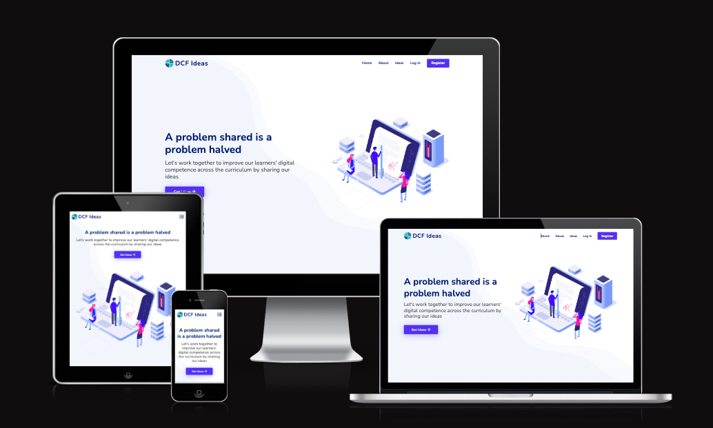

# **DCF Ideas**

DCF Ideas is a web Application, built specifically for the Milestone 3, Data-Centric Development Project for the Code Institute Full Stack Software Development Diploma. The purpose of the project, is to give users access to sharable information and ideas, around the Digital Competence Framework (DCF) for schools, through a number of different platforms. The Application is built, following the "CRUD" principles and will allow users to Create, Read, Update and Delete content. 

[View the live project on Heroku](https://dcfideas.herokuapp.com/)



---
## **Contents**

- [UX Design](#ux-design)
- [UI Design](#ux-design)
- [Wireframes](#wireframes)
- [Data Structure](#data-structure) 
- [Existing Features](#existing-features)
- [Future Features](#future-features)
- [Technologies Used](#technologies-used)
- [Testing](#testing)
- [Deployment](#deployment)
- [Credits](#credits)

---

## **UX Design**


### **User Goals**

- Be able to create, read, edit or delete own content.
- Be able to read content from other site users.
- Be able to read own posts from the profile page.
- Be able to use the application on Mobile, Tablet or Desktop devices. 

### **Site Owners Goals**

- Provide a positive experience for all users, looking to access the application.
- To create a space for all users to find inspiring DCF teaching ideas which meets all users' needs.

### **User Requirements and Expectations**
#### Requirements 

- Easily identifiable navigation
- Clean and structured layout
- Visually appealing elements
- Access to insightful ideas that promote a positive experience

#### Expectations

- When using the main navigational links, the user should be directed to each part of the application without issue.
- The ability to Create, Read, Update and Delete ideas, as set down in the sites overall purpose.
- Notifications that tell the user when they have carried out a relevant activity.

### **User Stories**

#### *New Visitor*
1. As a first time visitor, I want the main purpose of the site to be immediately clear.
2. As a first time visitor, I want the look of the site to be visually appealing.
3. As a first time visitor, I want the layout of the site to be well structured and easy to navigate.
4. As a first time visitor, I want to have an idea of the content that the site offers, before deciding to register.
5. As a frist time visitor, I want to be able to easily find and use the registration page, if I choose to register.
6. As a first time visitor, I want to see ways of communicating with the site's creators, via social media or a contact page.

#### *Registered User*
1. As a registered user, I want to be able to login with a set of registered credentials.
2. As a registered user, I want to be able to logout of my account.
3. As a registered user, I want to be able to change my user credentials.
4. As a registered user, I want to be able to see all ideas posted by other members.
5. As a registered user, I want to be able to edit or delete posts that I have created myself.
6. As a registered user, I want to be able to see a profile page where I can review my own idea posts.
7. As a registered user, I want to be able to quickly serach for relevant ideas.
8. As a registered user, I want to be able to delete my account in full, if I no longer wish to remain a member.

#### *Site Administrator*
1. As a site Administrator, I would want to be able to view all idea posts added by users, update and delete where necessary, keeping the site up-to date.
2. As a site Administrator, I would want to be able to add new users or delete users who have issues with functionality.

---

## **UI Design**

### Fonts
- The project uses Google Fonts for the delivery of the main font styling.
- The fonts used are Open Sans for main body and Nunito for headers. These have been used due to their clean and modern style.
- The back-up font used for the project is Sans-Serif.

### Colour Scheme

 The overall colour palette was designed from a website called [Coolors](https://coolors.co/). The colour scheme was chosen to make the site look visually appealing, using a blue colour palette, as this portrays calmness and confidence (using colour psychology). The colours were checked for sufficient contrast using [EightShapes](https://contrast-grid.eightshapes.com/?version=1.1.0&background-colors=&foreground-colors=%23565656%0D%0A%23012970%0D%0A%234154F1%0D%0A%232DB6FA%0D%0A%23F6F9FF%0D%0A%23FFFFFF%2C%20White%0D%0A&es-color-form__tile-size=compact&es-color-form__show-contrast=aaa&es-color-form__show-contrast=aa&es-color-form__show-contrast=aa18&es-color-form__show-contrast=dnp)


### Icons
- The strand icons were provided by [Flat Icon](https://www.flaticon.com/) library.
- All other icons were provided by the [Font Awesome](https://fontawesome.com/v5/search) library.

---

## **Wireframes**

### **Low Fidelity Wireframes**

Low fidelity wireframes were created with Balsamiq, and bring to life the basic prototyping structure of how the site may initially be designed to look. 

#### *Guest User*

- [Home Page](/documentation/images/wireframes/home-wireframe.png)
- [Registration Page](/documentation/images/wireframes/register-wireframe.png)
- [Login Page](/documentation/images/wireframes/login-wireframe.png)

#### *Registered User*

- [Home Page](/documentation/images/wireframes/home-wireframe.png)
- [Profile Page](/documentation/images/wireframes/profile-wireframe.png)
- [ideas Page](/documentation/images/wireframes/ideas-wireframe.png)

#### *Admin User*

- [Home Page](/documentation/images/wireframes/home-wireframe.png)
- [Profile Page](/documentation/images/wireframes/profile-wireframe.png)
- [ideas Page](/documentation/images/wireframes/ideas-wireframe.png)
- [Admin Dashboard](/documentation/images/wireframes/admin-wireframe.png)

---

## **Data Structures**
 - [MongoDB](https://www.mongodb.com/) is a cloud based storage application, hosting storage of the user account data for DCF Ideas. 
 - [PostgreSQL](https://www.postgresql.org/) is used as the backend functionality of the application, that allows users to create, read, update, delete and search data records on the app.

 ### **Outline of the structure used.**

- **Strands collection**
    - This collection holds the strand_name key. The strands relate to the strands from the Digital Compentency Framework for Wales, these are categories for the type of ideas that are being linked to. These strands are fixed, with no need to add/remove. There are element/sub-categories for each strand. 
    - The strand id links this collection to the idea collection.

- **Ideas collection**
    - This collection holds several keys for the ideas page where the user can create and view all the ideas in the database.
    - The data keys include the id,
    idea_name, cam_cynnydd, idea_description, subject, strand_id, created_by, created_at and idea_resource.

- **Users collection**
    - This collection holds two keys about the user which is provided by the user on the register page and used again on the log in page.
    - The data keys include the username and password. 

---

## **Existing Features**

The site has been built with responsiveness in mind with a similar and consistent aesthetic across multiple devices.

### **Features Across All Pages**

#### **Navbar**

The Navbar is made up of two sections:
    
1. Brand-Logo - The navbar features the main logo for the website. This is clickable and returns the user to the main home page for the site.

2. Navigation Menu Buttons - The navbar features the main navigation links, that allow users to move around the site. The navigation buttons show different options, depending on the status of the user:
    - Guest Users - will see the links to the Home, ideas, Login and Register pages.
    - Registered Users - will see the links to the Home, Profile, ideas and Log Out pages.
    - Admin Users - will see the links to the Home, Profile, ideas and Log Out pages, as well as a link to the Admin Dashboard page.

#### **Footer**

The footer is made up of three sections:

1. Site Title, Description and Social Icons- The footer contains a brief reminder of the sites title, a description of what the site is desigend to do and social media links.

2. Useful links - This section contants useful links for internal and external links.

3. Copyright Information - Has the built by information and copyright statement.

4. Contact Information - This section holds the contact information for the school that this project is built for.

#### **Return To Top Button**

- The Return To Top button, is a floating button that is controlled by JQuery code, showing a blue square button with an up arrow, in the bottom right of the webpage, once a certain scroll distance has been reached. The button when clicked, smoothly scrolls the user back to the top of the page being displayed.


### **Registration & Sign Up Page**

- The Registration page again features a simple form, where the user can input a username, email address and password. The form was designed to be as simple and fuss free as possible, in order to promote a positive user experience from the start.
- The form uses validation or error feedback when they enter information in to the input fields.
- If a user navigates to the registration page but already has an account, they can navigate to the login page via the login link. This can also be accessed via the Login page link in the navbar. 

### **Login Page**

- The login page is built around a simple form structure, where the user can enter either their username or their email address and their password.
- The form uses validation or error feedback when they enter information in to the input fields.
- If the user navigates to the login page but does not have an account, they can navigate to the registration page via the registration link. This can also be accessed via the Register link in the navbar.

### **Log Out** 
- If a user is logged in to their account, they can click on the log out button, where they will be logged out of the current session and will be taken back to the Login page.
- Should a registered user, wish to view the content of their profile again, they will be required to log back in to the site.

### **Home Page**

The Home page is split across three sections:

1. Brand-Logo & Description - This section gives the user an immediate sense of what the site is for and who it is aimed at. This section also hosts a call to action button promoting registration to the site.
2. Content Section - XXX

### **Profile Page** 
- When if the user registers an account, or logs in successfully, they are taken to their Profile page.
- The page features a header at the top, which pulls through their username form the database, giving added positivity in the user experience.
- There is a section that allows the user to update their email and password details, or delete their user account.
    - if the user chooses to edit their email address, a modal pop-up will appear and the user can input a new email address. The modal the has two buttons. One to submit the change and one to cancel the changes and take them back right back to the profile page.
    - if the user chooses to edit their password, a modal pop-up will appear and the user can input a new password. The modal the has two buttons. One to submit the change and one to cancel the changes and take them back right back to the profile page.
    - if the user chooses to delete their user account, a modal pop-up will appear and the user will be required to confirm their current password. The modal the has two buttons. One to submit the change and one to cancel the changes and take them back right back to the profile page. 
- If they have created any, the user can see all of their created ideas on their profile page.
- If the user has created any ideas, they will be able to see two buttons on each idea. These buttons allow editing and deleting functionality of the individual idea and are only accessible to the user that created the content and to the admin user of the site.

### **Ideas Page**
- Only a logged in and registered users can view the Ideas page, where the created content by all users is hosted.
- If a user has created any ideas, they will be able to see two buttons on each idea. These buttons allow editing and deleting functionality of the individual idea and are only accessible to the user that created the content and to the admin user of the site.
- There is a serach function user can search by strands and reset the search box.
- If the user clicks on the "Add a idea" button it will take them to the Add Idea Page.
- A floating button appears on the lower right of the screen when the user starts to scroll downwards. Clicking this moves the view back up to the top of the page. This feature was added because the ideas page can be quite long and the navbar is not fixed to the top of the page.

### **Add Idea Page**
- If the user clicks on the add idea button on the ideas page then they will be taken to the Add idea page.
- The add idea page is again built on a simple form structire, where the user can input the basic required information.
- The user will be required to add date to the idea in the following format:
    - Idea Title
    - Chosen Strand
    - Date Added
    - idea Description
    - idea Link
- The admin user will see a checkbox which uses Materialize's switch class, to toggle the weekly featured ideas on and off.
- The form uses validation or error feedback when they enter information in to the input fields.
- If the user clicks add idea button, it will add the new idea to the database.
- If the user clicks on the cancel button it will take them back to the ideas page.

### **Edit Ideas Page**
- The edit ideas page features a simple form, where the user can edit only a idea added by them. 
- If the user has clicked on the Edit idea button, then they are taken to the edit page. They will only be able to edit the idea if they created the idea.
- The current idea information will be shown and the user can change the information and save it. This will update the database with the new information.
- The user will be able to select from the current strands, as well as all additional elements that can be updated.
- The form uses validation or error feedback when they enter information in to the input fields.
- If the user clicks on the cancel button it will take them back to the ideas page.
- The edit idea page contains a switch style checkbox button, that when selected, triggers the idea to be part of a weekly featured section on the home page. The switch toggles the "on" and "off" value for the key of weekly_featured in the database.

### **Admin Dashboard Page**
- This page can only be viewed by the admin user.
- From here the admin user can manage the sites ideas.
- The admin user can add a new idea if they click on the add idea button. This will take them to the Add new Idea page.
- The admin user can edit current ideas. If the user clicks on the manage ideas button, they will be taken to a page where they can edit or delete the details of an existing idea.

#### **Add New Idea page**
- This page can only be viewed by the admin user.
- If the admin user clicks on the add ideas button on the dashboard, then this page will display.
- The form uses validation or error feedback when they enter information in to the input fields.

### **404 & 500 Page**
- The custom 404 & 500 Pages contain a simple word layout letting the user know of the error and a button that can be clicked to take the user back to the home page.

---

## **Future Features**

The site has been launched with a minimal viable product phase in mind. This allows the site to incorporate future features, that will improve the overall offering and user experience that is gained. Future features may include elemets such as:

- Additional profile functionality, with the option to add user profile images, a personal statement and options around marketing preferences.
- Functionality to retrieve and update a forgotten password.
- The ability to bookmark ideas added by other users and view them in a section on the profile page.
- The ability to run improved search capabilities, as the current search is basic.
- Allow an administrator user the option to toggle other site users as administrators.
- Give site administrators full functionality of creating, updating or deleting user accounts via an admin dashboard.

---

## **Technologies Used**

### Development Languages
- The project is built using the HTML, CSS, Javascript and Python programming languages.

### Development Tools
- [GitHub](https://github.com/)
    - The cloud based repository platform, used to hold the programme files and documents upon which the application depends.

- [Gitpod](https://www.gitpod.io/)
    - The Intergrated Development Environment used to work on the programming files.

- [Heroku](https://id.heroku.com/login)
    - A cloud based platform allowing developers to build, run and operate applications.

- [MongoDB](https://www.mongodb.com/)
    - Cloud based database platform, used to hold data for applications.

### Libraries, Frameworks and Dependencies
- [Bootstrap](https://getbootstrap.com/)
    - The project uses the Bootstrap library to simplify the background code for the website, as well as it's overall responsiveness when in use. 
- [Font Awesome](https://fontawesome.com/)
    - he majority of the icons used are from the Font Awesome library.
- [Google Fonts](https://fonts.google.com/)
    - The fonts for the project are taken from the Google Fonts library.
- [Pymongo](https://pypi.org/project/pymongo/) and [Flask-PyMongo](https://flask-pymongo.readthedocs.io/en/latest/) 
    - To connect Python and Flask to the MongoDB database
- [Flask](https://flask.palletsprojects.com/en/) 
    - To construct and render page templates, and create an instance of the app itself.
- [MongoDB Atlas](https://www.mongodb.com/)
    - A cloud-based Non-Relational backend database hosting service.
- [Werkzeug](https://werkzeug.palletsprojects.com/en/)
    - A WSGI web application library used for hashing user passwords for Python.
- [Jinja](https://jinja.palletsprojects.com/en/)
    - Templating language for Python, to simplify displaying data from the backend of this project smoothly and effectively in HTML.
- [jQuery](https://jquery.com/)
    - JavaScript library used to promote more simplistic JavaScript code throughout the project.
- [SQLAlchemy](https://www.sqlalchemy.org/)
    - Used to filter and search through the database.

### Design Tools

- [Balsamiq](https://balsamiq.com/)
    - Cloud or application based wireframing software, used for building low fidelity mockups. 
---

## **Testing**

View the overall testing report for the site here: [TESTING.md](TESTING.md)

---

## **Deployment**
The project uses GitHub for version control, Gitpod as the development platform and Heroku for final production deployment.

### **Cloning the project through GitHub:**
- To clone the project from the GitHub repository, visit https://github.com/chelsea-designs/DCFideas
- Above the central file container of the repository, click the "Code" button.
- Save the downloaded repository file to your machine and open the folder with your chosen development platform.

Alternatively, you can clone the repository directly through your terminal, using:
```
git clone https://github.com/chelsea-designs/DCFideas
```

In order to work with the application, you will need to have the following technologies installed in your working environment:

- [PIP3](https://pip.pypa.io/en/stable/installation/)
- [Python3](https://www.python.org/downloads/)

### **Setting Up MongoDB Atlas for Database Usage**
The project uses MongoDB for its backend database functionality. If you wish to create your own database of information to use with this project, you will need to create an account with MongoDB Atlas. Details on how to do this, can be found here: [MongoDB Atlas](https://docs.atlas.mongodb.com/).

When setting up the database, the following setps are required:

1. Start by creating a Cluster (this will be the service that the database will run on).
2. Add and authenticate a new database user.
3. Once the cluster has been created, click the 'Browse Collections' button.
4. Click '+ Create Database'.
5. Click on the 'Create Collection' button.
6. Create the data collections that you want in the database.
7. Click on 'Insert Document'.
8. Add the neccessary key: value pairs, to be collected in each collection.

### **Flask Development Setup**

In order to build the application, the following steps are to be taken:

1. Firstly you need to install Flask. In your terminal, type:
```
pip3 install flask
```

2. Next is to create a few new files. First will be a Python file, that will be the foundation of the application. Your can call your file anything, but in this instance, I will call the file `app.py`:
```
touch app.py
``` 

3. Next we create a file called `env.py`, in which to store sensitive data using environment variables, so type:
```
touch env.py
```

4. Our `env.py` file should never be pushed to GitHunb and needs to be ignored. To do this first create a `gitignore`file by typing:
```
touch .gitignore
```

5. Within the gitignore file, add the `env.py` file and `__pycache__/` directory, which will be auto-generated shortly. 

6. Now we need to add several bits of data to the `env.py` file. Open the file and add the following:
```
import os

os.environ["IP"] = "0.0.0.0"
os.environ["PORT"] = "5000"
os.environ["SECRET_KEY"] = "YOUR_SECRET_KEY"
os.environ["MONGO_URI"] = "YOUR_MONGODB_URI"
os.environ["MONGO_DBNAME"]= "DATABASE_NAME"
```

7. Next we need to add some data to the `app.py`file. Open the file and add the following:
```
import os

from flask import (
Flask, flash, render_template,
redirect, request, session, url_for)
from flask_pymongo import PyMongo
from bson.objectid import ObjectId
from werkzeug.security import generate_password_hash, check_password_hash
if os.path.exists("env.py"):
    import env
```

8. Now we can create an instance of Flask, that will be stored in a variable called 'app'.
```
app = Flask(__name__)
```

9. Finally, we can test the application. To do this, we need tell our app how and where to run the application. Set up your 'IP' and 'PORT' environment variables in the hidden `env.py` file. Make sure to udate the `debug=True` varieable to `debug=False` before final deployment.
```
if __name__ == "__main__":
app.run(host=os.environ.get("IP"),
port=int(os.environ.get("PORT")),
debug=True)
```

10. You can now run your application from the command line using:
```
python3 app.py
```

### **Deploy the application to Heroku**

1. Before you create your Heroku application, you need to setup some files that Heroku needs
to run the app.

2. First, you need to tell Heroku which applications and dependencies are required to run our app. In the terminal, type:
```
pip3 freeze --local > requirements.txt
```

3. Next is the Procfile. This is what Heroku looks for to know which file runs the app, and how to
run it. In the terminal, type:
```
echo web: python app.py
```
- The Procfile might add a blank line at the bottom, and sometimes this can cause problems, when running our app on Heroku, so just delete that line and save the file.

4. Now head to [Heroku.com](https://id.heroku.com/login) and create an account. When you are logged in, click on the button labeled "New" and select "Create new app".

5. Give your app a name and select a local location.

6. On the Heroku dashbord from within your app, click on the 'GitHub - Connect to GitHub' button and serach for the name of the GitHub relevant repository. Then click 'Connect'.

7. When the repository is showing as connected, and before selecting 'Enable Automatic Deploys', click on the settings tab for the app, and then click on 'Reveal Config Vars'. Here you will tell Heroku, which variables are required. These will be the key:value environment variables, from the `env.py` file:
```
["IP"] = "0.0.0.0"
["PORT"] = "5000"
["SECRET_KEY"] = "YOUR_SECRET_KEY"
["MONGO_URI"] = "YOUR_MONGODB_URI"
["MONGO_DBNAME"]= "DATABASE_NAME"
``` 

8. Next, commit the `requirements.txt` and `procfile` to GitHub, to ensure all files are available on the repository.

9. Finally, head back to Heroku and click on the 'Enable Automatic Deploys' button. Heroku will now start building the application from the GitHub repository.

10. Once the application has been built, click on the 'Open App' button on the dashboard.
---

## Credits

### **Content**
- Text about the Digital Competence Framework from [Twinkl DCF](https://www.twinkl.co.uk/teaching-wiki/dcf-wales#:~:text=The%20DCF%20(Wales)&text=developing%20listening%2C%20reading%2C%20speaking%20and,technologies%20to%20help%20them%20function)
- All other code and text for this website was created by Chelsea Williams.

### **Media**
- The illustrations used for this website was included in the theme from [BootstrapMade](https://bootstrapmade.com/demo/FlexStart/)

### **Code**
- Theme from [BootstrapMade](https://bootstrapmade.com/demo/FlexStart/)
- Toggle Password Visibility adapted from [W3 Schools](https://www.w3schools.com/howto/howto_js_toggle_password.asp)
- Copy text button adapted from [W3 Schools](https://www.w3schools.com/howto/howto_js_copy_clipboard.asp)
- Dropdown with submenu from [W3 Schools](https://www.w3schools.com/bootstrap/tryit.asp?filename=trybs_ref_js_dropdown_multilevel_css&stacked=h)
- Elements adapted from [Bootstrap](https://getbootstrap.com/)
- JQuery for validation from Task Manager walkhtrough project by Code Institute

---

### **Acknowledgements**
- Thanks to my mentor Narender Singh for guiding me throughout this project.
- Thank you to Shane Muir, a Code Institute alumnus, who responded to my Slack pleas for help!
- Thank you to Chris U, a Code Institute alumnus, who responded to my Slack peer-code-review request with useful feedback.

##### back to [top](#contents)